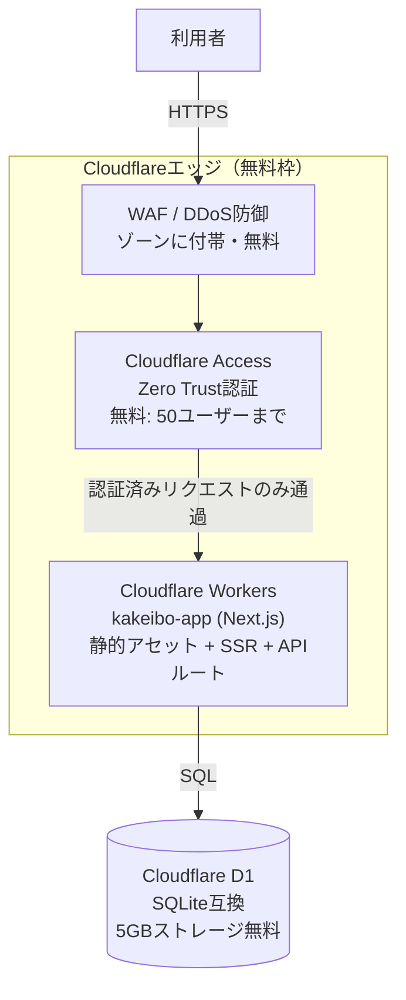

# デプロイ構成 spec（案）

> ステータス: 検討中（未実装）
> 目的: kakeibo-appを外部公開しても安全に運用できる構成を、無料枠の範囲で組む

## 背景

kakeibo-appは現状ローカル専用（`node:sqlite`でファイルDBに書き込み、認証なし）。
外部公開するにあたり、以下を無料で満たしたい。

- セキュリティ: 未認可アクセスの遮断、WAF/DDoS対策
- 可用性: エッジ配信、単一障害点を作らない

## 構成イメージ

## コンポーネント

| レイヤー | 役割 | 無料枠の目安 |
|---|---|---|
| WAF / DDoS防御 | 悪意あるリクエストをエッジで遮断 | Cloudflareゾーンに標準付帯 |
| Cloudflare Access | ログイン画面を挟み、未認可アクセスをブロック（アプリ側に認証機構を作らない） | 50ユーザーまで無料 |
| Cloudflare Workers | Next.jsアプリ本体（静的アセット配信 + SSR + `/api/kv`） | 10万リクエスト/日、10ms CPU/リクエスト |
| Cloudflare D1 | 家計簿データの永続化（SQLite互換） | 5GBストレージ、読取500万行/日、書込10万行/日 |

## 現状からの変更点

- `lib/db.js`: `node:sqlite`によるローカルファイルDB → D1バインディング経由のクエリに置き換え
  （WorkersランタイムにはローカルファイルシステムへのSQLite永続化がないため）
- 認証: アプリコードでは実装せず、Cloudflare Access側の設定で担保
- デプロイ: `wrangler deploy`（Next.js向けは`vinext`または`OpenNext`アダプタ経由）

## 未検討事項

- CI/CD（GitHub Actions等）の構成
- Cloudflare Access のログイン方式（メールOTP / GitHub OAuth等）
- D1のバックアップ/マイグレーション運用
